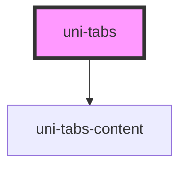

# my-component

<!-- Auto Generated Below -->

## Properties

| Property        | Attribute        | Description | Type                                           | Default       |
| --------------- | ---------------- | ----------- | ---------------------------------------------- | ------------- |
| `color`         | `color`          |             | `"accent" \| "primary" \| "success" \| "warn"` | `undefined`   |
| `feature`       | `feature`        |             | `string`                                       | `'uni.store'` |
| `frame`         | `frame`          |             | `boolean`                                      | `false`       |
| `mini`          | `mini`           |             | `boolean`                                      | `false`       |
| `path`          | `path`           |             | `string`                                       | `'tab'`       |
| `pathId`        | `path-id`        |             | `string`                                       | `undefined`   |
| `pro`           | `pro`            |             | `boolean`                                      | `false`       |
| `selectedIndex` | `selected-index` |             | `number`                                       | `0`           |
| `shadow`        | `shadow`         |             | `boolean`                                      | `false`       |
| `stacked`       | `stacked`        |             | `boolean`                                      | `false`       |
| `top`           | `top`            |             | `boolean`                                      | `false`       |
| `type`          | `type`           |             | `"local" \| "memory" \| "session"`             | `'memory'`    |
| `value`         | `value`          |             | `Partial<UniTabData>[] \| string`              | `[]`          |

## Dependencies

### Depends on

- [uni-tabs-content](../components/content/@element)

### Graph

----------------------------------------------

*Powered by [UiWebKit](https://uiwebkit.com/)*
