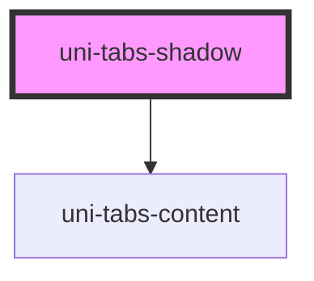

# uni-tabs-shadow

<!-- Auto Generated Below -->

## Properties

| Property        | Attribute        | Description | Type                              | Default     |
| --------------- | ---------------- | ----------- | --------------------------------- | ----------- |
| `only`          | `only`           |             | `boolean`                         | `false`     |
| `path`          | `path`           |             | `string`                          | `'tab'`     |
| `pathId`        | `path-id`        |             | `string`                          | `undefined` |
| `selectedIndex` | `selected-index` |             | `number`                          | `undefined` |
| `value`         | `value`          |             | `Partial<UniTabData>[] \| string` | `[]`        |

## Dependencies

### Depends on

- [uni-tabs-content](../components/content/@element)

### Graph

----------------------------------------------

*Powered by [UiWebKit](https://uiwebkit.com/)*
