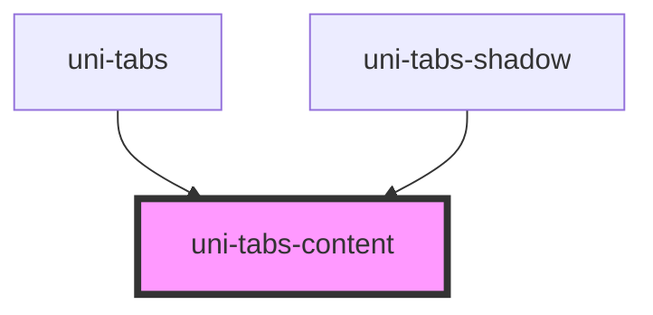

# uni-tabs-content

<!-- Auto Generated Below -->

## Properties

| Property | Attribute | Description | Type                              | Default     |
| -------- | --------- | ----------- | --------------------------------- | ----------- |
| `path`   | `path`    |             | `string`                          | `'tab'`     |
| `pathId` | `path-id` |             | `string`                          | `undefined` |
| `value`  | `value`   |             | `Partial<UniTabData>[] \| string` | `[]`        |

## Dependencies

### Used by

 - [uni-tabs](../../../@element)
 - [uni-tabs-shadow](../../../@shadow)

### Graph

----------------------------------------------

*Powered by [UiWebKit](https://uiwebkit.com/)*
